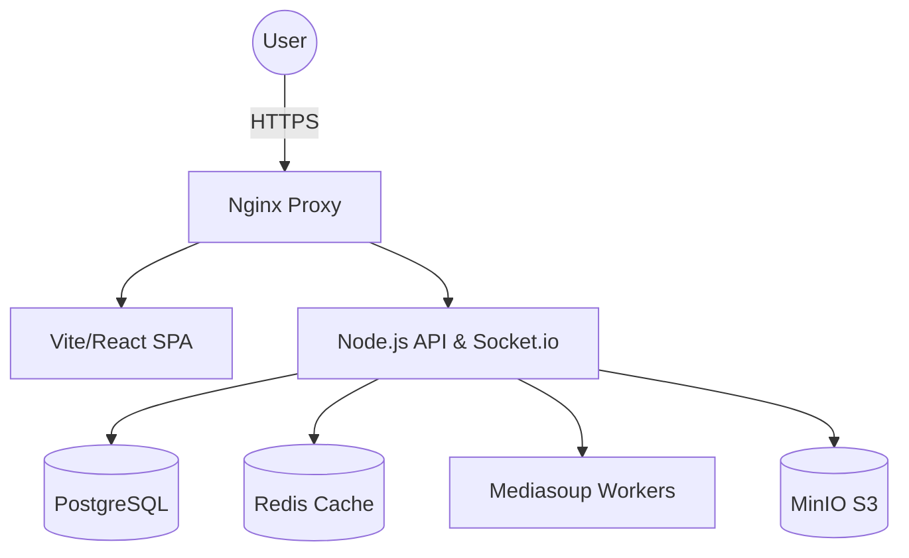
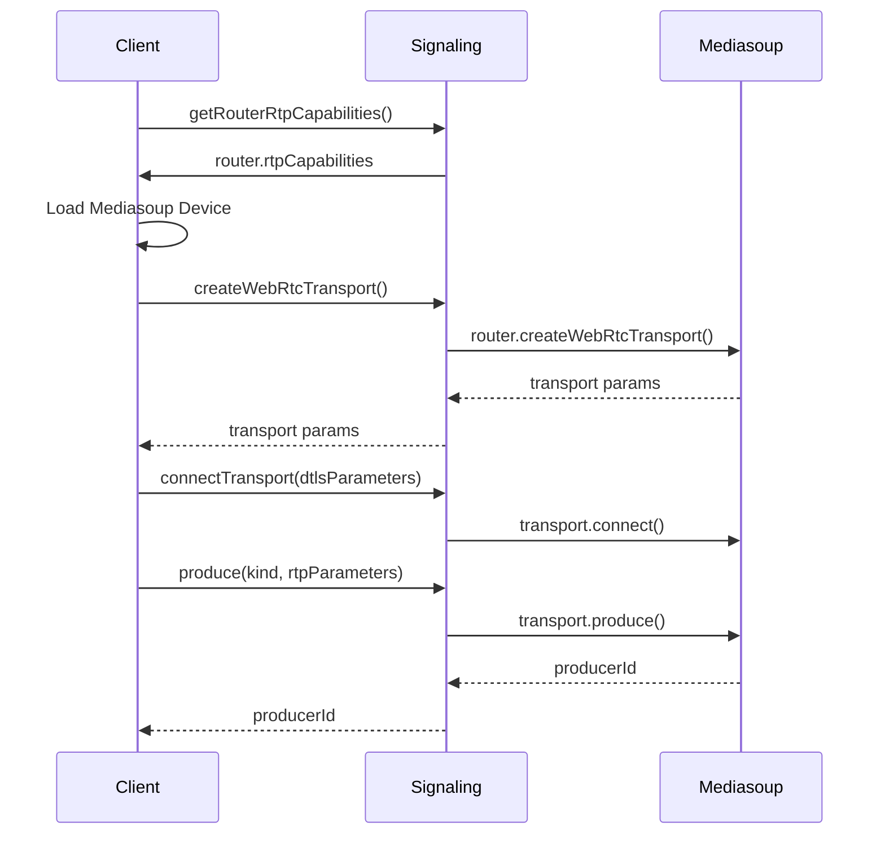
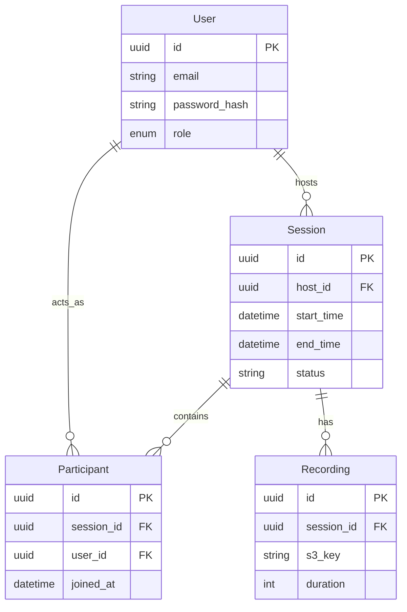
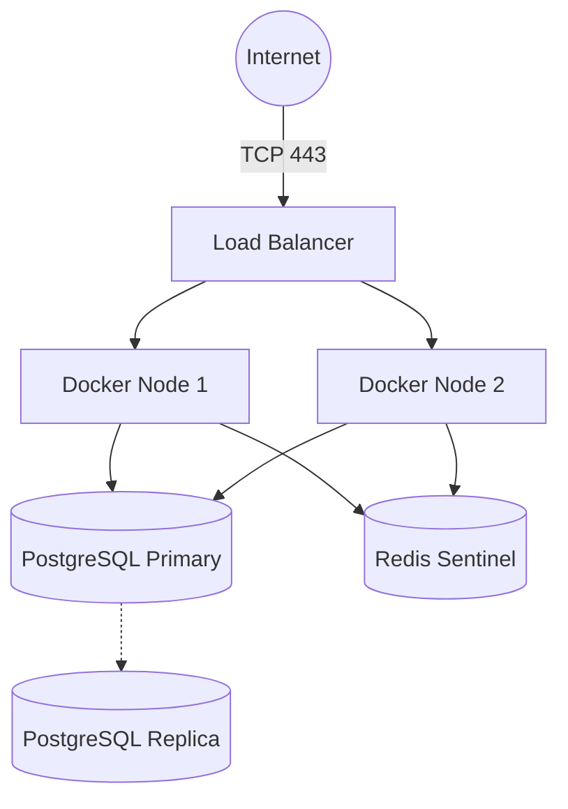
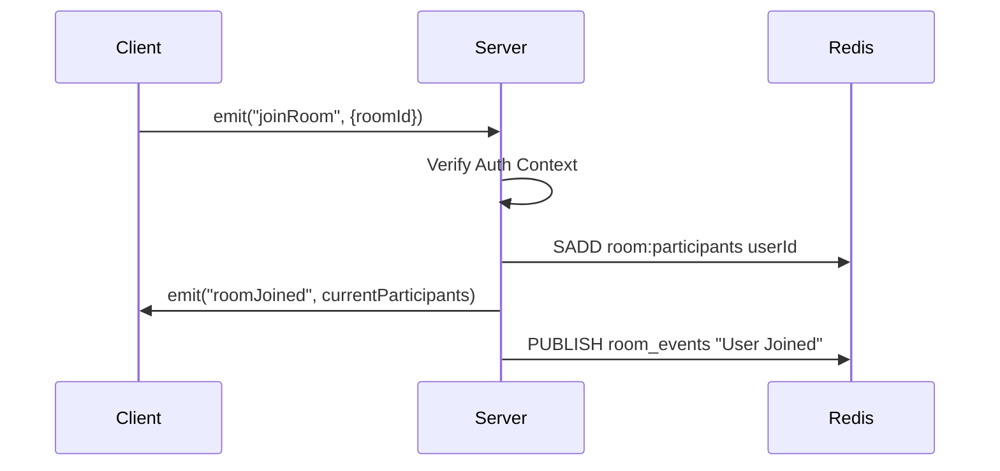
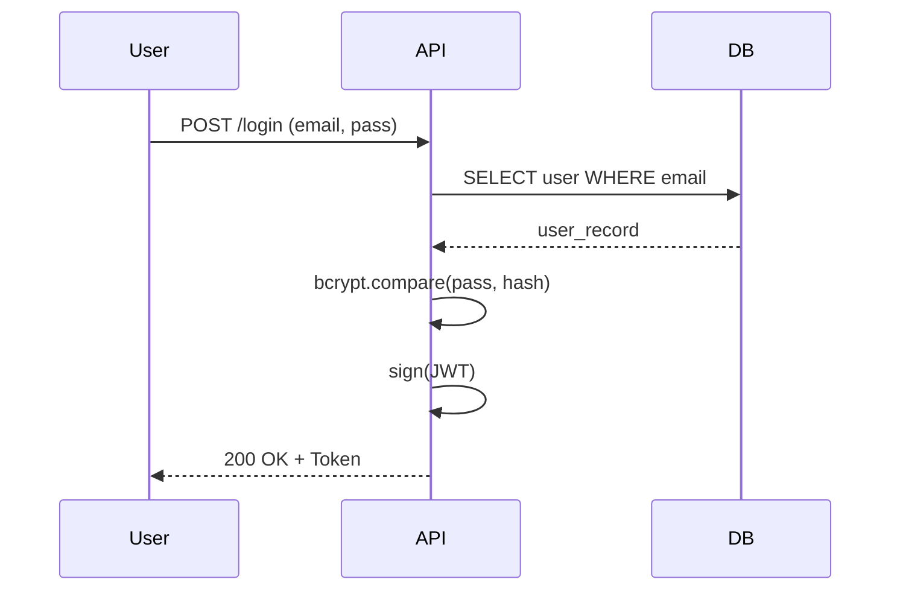
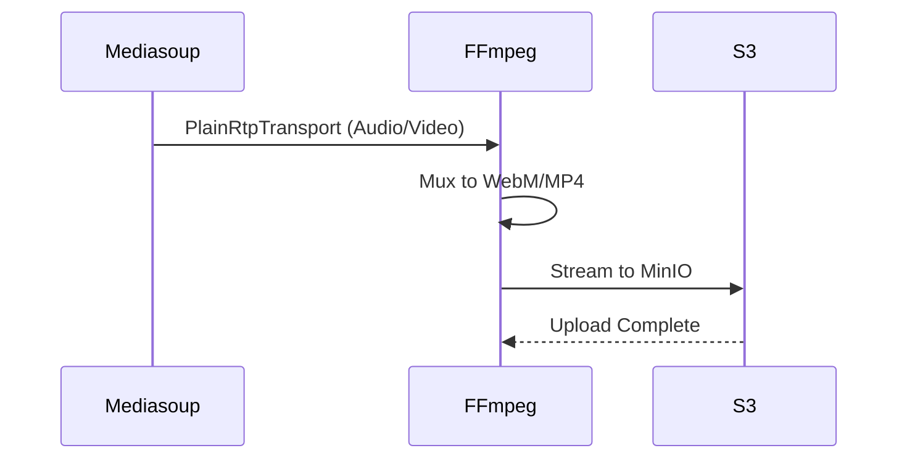
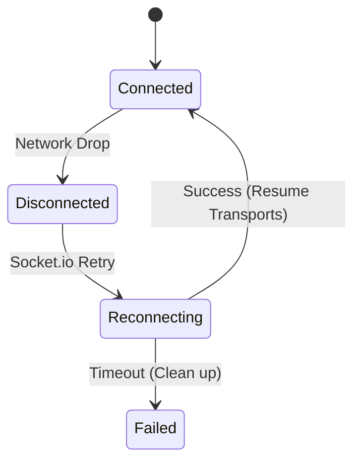

# SupportVision Architecture

## System Overview
SupportVision utilizes a modern decoupled architecture featuring a React frontend, Node.js/Express backend, PostgreSQL for persistent storage, Redis for session state and pub/sub, and Mediasoup as an SFU (Selective Forwarding Unit) for WebRTC media routing.

## Component Descriptions
- **Web Client**: React SPA handling UI, WebRTC connections via mediasoup-client.
- **API Server**: Node.js REST API for authentication, session management, and signaling.
- **Signaling Server**: Socket.io integrated with the Node.js backend for real-time events.
- **Media Server (SFU)**: Mediasoup workers managing WebRTC Transports, Producers, and Consumers.
- **Database**: PostgreSQL storing user accounts, session logs, and recording metadata.
- **Cache / PubSub**: Redis used for rate limiting, active session caching, and multi-node pub/sub.
- **Storage**: MinIO (S3-compatible) for storing recorded session videos and shared files.

## 1. System Architecture

## 2. WebRTC Media Flow via Mediasoup

## 3. Database ER Diagram

## 4. Deployment Architecture

## 5. Socket Event Flow

## 6. Authentication Flow

## 7. Recording Flow

## 8. Reconnection Flow

## Technology Choices and Rationale
- **Node.js**: Excellent asynchronous I/O, perfect for WebSockets.
- **Mediasoup**: Extremely performant C++ WebRTC worker, scales better than pure Node.js SFUs.
- **PostgreSQL**: ACID compliance for strict session auditing and billing.
- **Redis**: Enables multi-node scaling for Socket.io.

## Data Flow Descriptions
State is managed via Redis for ephemeral real-time data, while PostgreSQL serves as the source of truth for session history, analytics, and user accounts. Media flows purely over UDP (falling back to TCP) strictly handled by Mediasoup workers to avoid V8 garbage collection pauses.

## Security Architecture
- JWT-based authentication with short expirations.
- Role-Based Access Control (RBAC) middleware.
- WebRTC is inherently end-to-end encrypted via DTLS/SRTP.
- API requests are rate-limited via Redis.
- CORS strictly configured to frontend domains.

## Scalability Considerations
- **Horizontal Pod Autoscaling**: API nodes can scale independently of Media workers.
- **Media Routing**: Mediasoup workers map 1:1 with CPU cores.
- **Database**: Read replicas handle complex session history queries.
